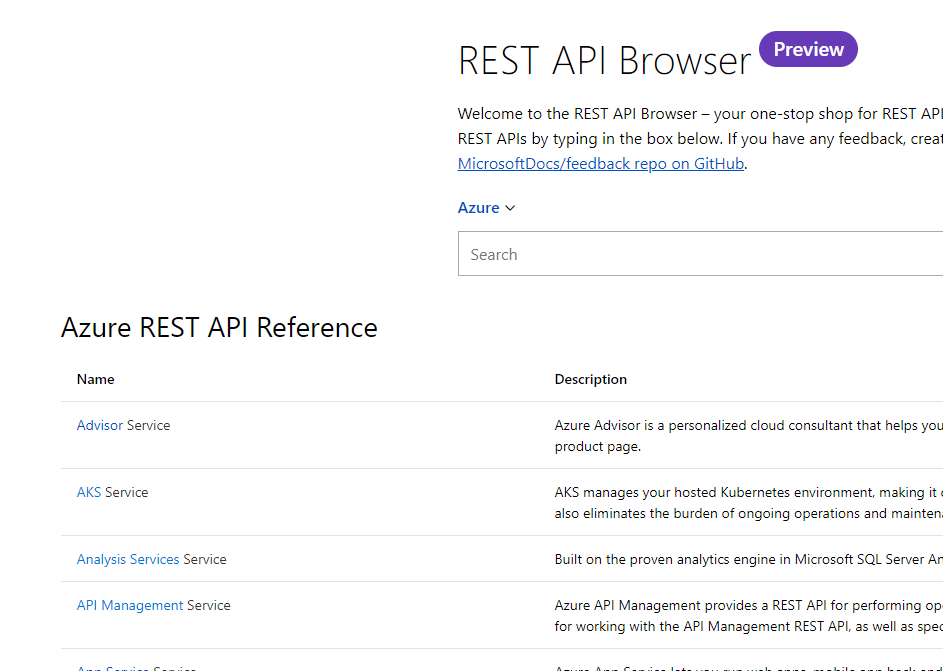
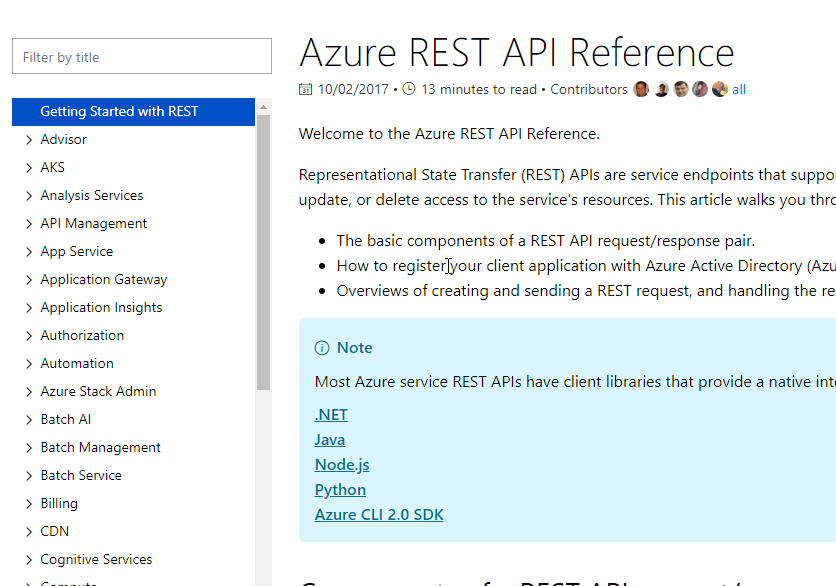
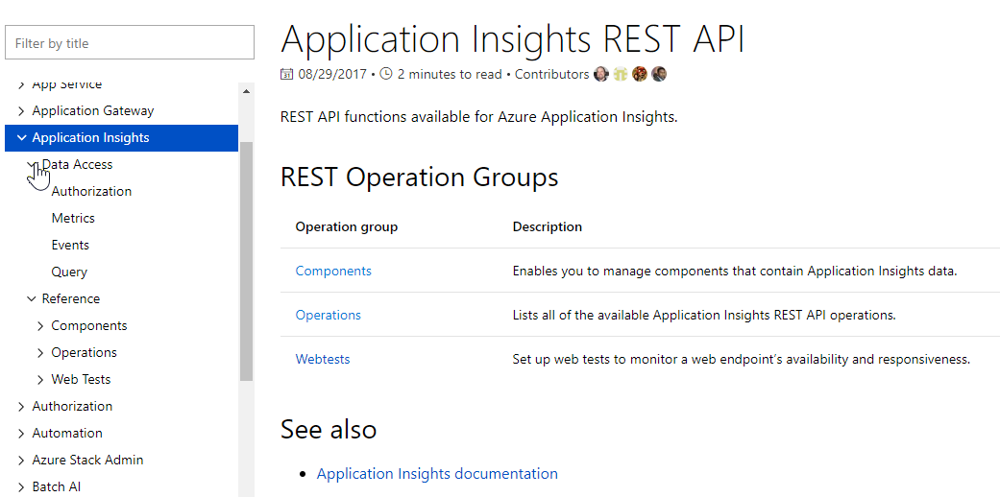
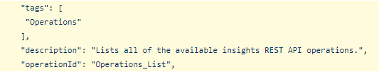
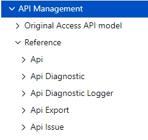
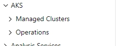

# Layout Construction

Let's walk through how the Application Insights REST documentation gets generated. Creating the REST documentation involves two repositories: 

* [https://github.com/Azure/azure-rest-api-specs](https://github.com/Azure/azure-rest-api-specs)
* [https://github.com/Azure/azure-docs-rest-apis](https://github.com/Azure/azure-docs-rest-apis)

The azure-docs-rest-apis repository contains [mapping.json](https://github.com/Azure/azure-docs-rest-apis/blob/master/mapping.json) which provides the top-level structure displayed in the [REST API browser](https://docs.microsoft.com/en-us/rest/api/?view=Azure) and [REST API reference page](https://docs.microsoft.com/en-us/rest/api/azure/) menus. 

The [App Insights section](https://github.com/Azure/azure-docs-rest-apis/blob/392bfd14d02608fc27809bd710db932bf5ac6403/mapping.json#L152-L167) of mapping.json pulls in three Swagger files from the azure-rest-api-specs repository. Before going into the spec, let's look at the landing page on the docs site.


The section on operation grouping may not be fully accurate.


The landing page contains three operation groups: Components, Operations, and Webtests. The operation grouping can come from two places in the Swagger specification: [operationId or tags](https://github.com/Azure/azure-rest-api-specs/blob/95681b629bc2b2a2f31bae1e94ce4eb81f6ee91c/specification/applicationinsights/resource-manager/Microsoft.Insights/stable/2015-05-01/aiOperations_API.json#L33-L37). There is a priority of how operations group after generation. The operationId splits on an underscore and the first portion becomes the operation group. You can add a Tags section with a string to group items in the absence of the operationId. Without any grouping, the behavior appears to be implementation defined. Without other defined grouping, it seems individual files correspond to their own nodes. 

The mapping.json file also contains some paths to files which describe the content of the documentation. The service\_index path describes the landing page for the service's node in the top level table of contents. The service\_toc is a markdown file containing some metadata and a list of links. The links produce the table of contents for the service. The files for Application Insights are:

* [service\_index](https://github.com/Azure/azure-docs-rest-apis/blob/master/docs-ref-conceptual/application-insights/index.md)
* [service\_toc](https://github.com/Azure/azure-docs-rest-apis/blob/master/docs-ref-conceptual/application-insights/toc.md)

Notice that service\_toc only contains the non-reference nodes. It appear the publishing process generates reference documentation and table of contents from the Swagger directly using the operation groups. If no service\_toc exists or if it is empty, then the operation groups become the top level set of nodes under the service \(AKS is a good example here\). If service\_toc contains configuration in it, then the generation processes it and uses it as one top level node under the service, and it places all the auto-generated swagger content under a new Reference node \(e.g. App Insights, API Management\). 

